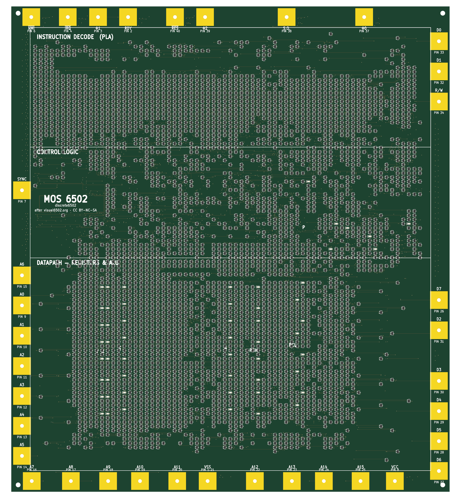
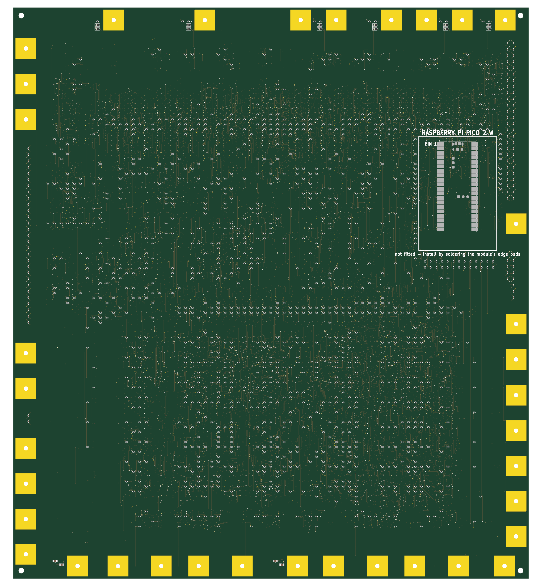

# discrete6502

A working **MOS 6502 CPU built from 4,051 discrete surface-mount transistors** (3,996 logic + 55 LED drivers), laid out as a
291 × 322 mm six-layer PCB that visually reproduces the original 6502 die — every FET sits at
its transistor's die-true position, 55 LEDs blink the register bits in place, and a ring of
die-scaled bond pads around the edge takes crocodile clips.

Inspired by the [MOnSter 6502](https://monster6502.com/) (concept only — independently designed
and simplified). Logic ground truth is the [visual6502](http://visual6502.org) reverse-engineered
netlist, captured from photographs of a real decapped 6502.

| Front (the die) | Back (passives + Pico site) |
|---|---|
|  |  |

## Status

Design complete and verified; ready to order (fab package in `gen/fab/`, checklist in
`gen/fab/ordering.html`). Bring-up (M6) starts when boards arrive.

| Milestone | State |
|---|---|
| M1 Research (visual6502 data, MOnSter lessons) | ✅ |
| M2 Feasibility (dynamic NMOS, pass-FET pairs, SPICE) | ✅ |
| M3 Toolchain (KiCad, scripted netlist pipeline) | ✅ |
| M4 Verification (switch-level equivalence, vendor-model SPICE) | ✅ |
| M5 Layout (placement, routing, DRC-clean, fab outputs) | ✅ |
| M6 Fab & bring-up | ⏳ |

## Highlights

- **Faithful dynamic NMOS logic** — not a static re-design: the visual6502 netlist's 3,239 unique
  transistors, with the 778 bidirectional pass transistors implemented as back-to-back FET pairs
  (BSS138K; clock-edge bootstrap validated in SPICE with the manufacturer's model) and 1,023
  pull-up resistors standing in for the depletion loads. Realistic clock ~10–20 kHz — the decode-PLA
  input lines drive up to 71 discrete gates behind one 10k pull-up (`sim/fanout_speed.sp`).
- **Machine-checked correctness**: a switch-level simulator proves the transformed netlist
  produces bit-identical traces to the original visual6502 netlist while running real 6502
  code; board-vs-netlist parity and independent copper-connectivity checks close the chain.
  Final DRC: zero electrical violations.
- **Custom autorouter** (`tools/route_nc.c/.py`): a PathFinder-style negotiated-congestion router
  — nets route through conflicts, shared cells get iteratively penalized, conflicted nets
  rip-up and retry — on a 0.13 mm grid over 4 routing layers, with warm-start checkpoints.
  8,421 signal connections routed; the C core does a full negotiation iteration in seconds.
- **Bring-up harness built in**: an unpopulated Raspberry Pi Pico 2 W site on the back acts as
  clock master and memory emulator (data bus, 14 address bits with 16 KB mirroring, reset,
  R/W, SYNC via factory-fitted series resistors). Solder a Pico on, flash firmware, and the
  CPU runs programs with full bus tracing — no other computer needed.

## Power budget

Dominated by the NMOS pull-up current, not switching. Component counts are from
`gen/netlist.json`; the LED figure is simulated (`sim/led_tap.sp`).

| Contribution | Basis | Typical | Worst case |
|---|---|---|---|
| Pull-up static current | 1,023 × 10 kΩ, 0.50 mA per node held low; ~half low at any moment (worst case: all) | 0.26 A / 1.28 W | 0.51 A / 2.56 W |
| Register LEDs | 55 taps × 1.42 mA; ~half the monitored bits set (worst case: all lit) | 0.04 A / 0.20 W | 0.08 A / 0.39 W |
| Dynamic switching | 109 nF total gate capacitance; 21 nF of it on clock-rate nets, rest at ~15% activity, at 10 kHz | ~9 mW | ~45 mW at 50 kHz |
| Pico 2 W, if VSYS is soldered | ~30 mA at 3.3 V through its buck | 0.02 A / 0.12 W | 0.03 A / 0.15 W |
| **Total @ 5 V** | | **≈ 0.32 A / 1.6 W** | **≈ 0.63 A / 3.2 W** |

**A 5 V / 1 A bench supply covers even the worst case.** Spread over the 900 cm²
board the heat is imperceptible — compare the original MOnSter 6502 at ~10 W.

At the recommended 3.3 V first bring-up (Pico on USB, off the board rail):
**≈ 0.19 A / 0.64 W typical, 0.38 A / 1.3 W worst case**. The LEDs there draw
0.67 mA each instead of 1.42 mA, because the 2.2 kΩ ballast has 1.4 V less
headroom above the LED's ~1.85 V forward drop — 47% of the current, but only
about 20% less *perceived* brightness (perception goes roughly as the cube root
of luminous output): dimmer, still perfectly readable.

Transient behaviour is more interesting than the average: the `cclk` net alone
carries 13 nF of gate load (482 gates), so clock edges pull ~50–100 mA for a
microsecond or two. That is what the 96 distributed 100 nF decouplers and 4 ×
10 µF bulk caps are for — they hold the rail to ~10 mV of droop across an edge.

## Repository layout

- `project-plan.md` — goals, milestones, decision log, current handoff (start here)
- `cards/` — deep-dive notes per topic (architecture, layout, verification, …)
- `data/visual6502/` — the reverse-engineered netlist source data
- `tools/` — the entire generation pipeline: netlist transform, die placement, power routing,
  the negotiated-congestion signal router, finishing passes, silkscreen, verification
- `sim/` — ngspice testbenches: pass-pair latch, 3.3 V validation, LED brightness, fanout speed
- `gen/` — generated artifacts: netlist, boards (`board_routed_golden.kicad_pcb`), renders,
  and the JLCPCB fabrication package (`gen/fab/`)

## Regenerating the board

The full pipeline, in order (KiCad 10's bundled python for board steps):

```
python3 tools/gen_netlist.py         # visual6502 data -> netlist (+ invariant checks)
python3 tools/switchsim.py           # equivalence gate: must stay green
<kicad-python> tools/gen_pcb.py      # die-true placement, board setup
<kicad-python> tools/route_power.py  # planes + ~3,700 stitch vias
<kicad-python> tools/route_power_finish.py   # (on the presignal snapshot)
<kicad-python> tools/route_nc.py     # signal routing (hours; checkpointed)
<kicad-python> tools/fix_same_net_vias.py
<kicad-python> tools/fix_via_pairs.py
<kicad-python> tools/add_silk.py
<kicad-python> tools/check_parity.py && tools/check_gaps.py + kicad-cli drc
```

See `cards/layout.md` for the rules and hard-won caveats behind each step.

## License & attribution

The design derives from the visual6502 project's netlist data (`segdefs.js` is
**CC BY-NC-SA** — noncommercial). This project is a hobby build and inherits that spirit:
**non-commercial use only**, attribution to [visual6502.org](http://visual6502.org).
The MOnSter 6502 by Eric Schlaepfer & Evil Mad Scientist Laboratories proved a discrete
6502 is possible and is gratefully acknowledged as inspiration.
