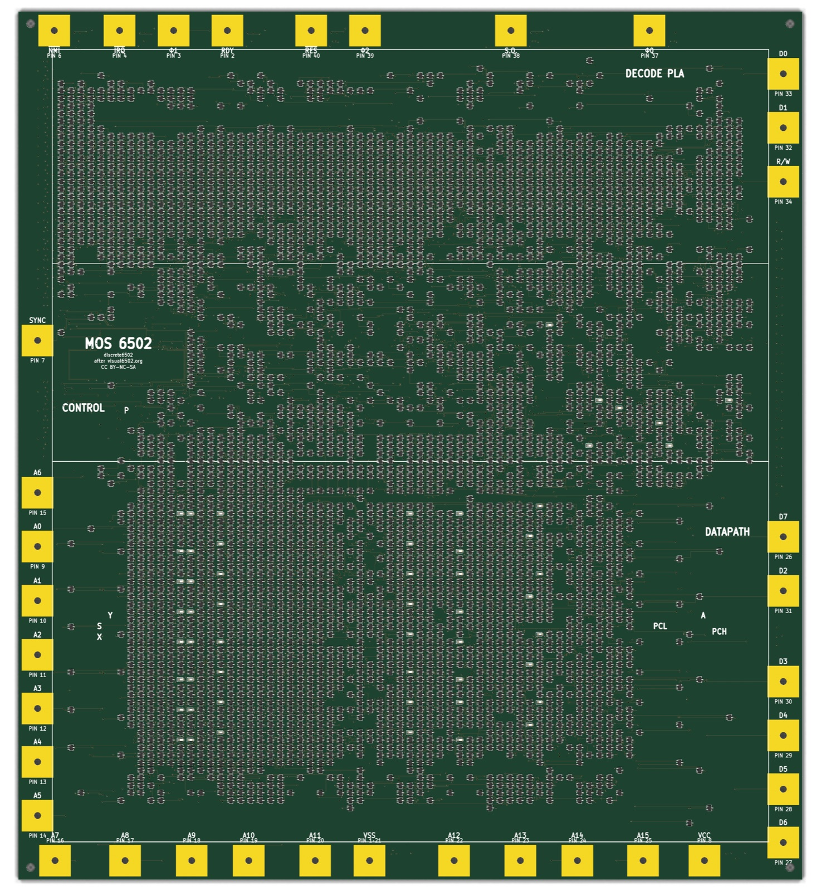
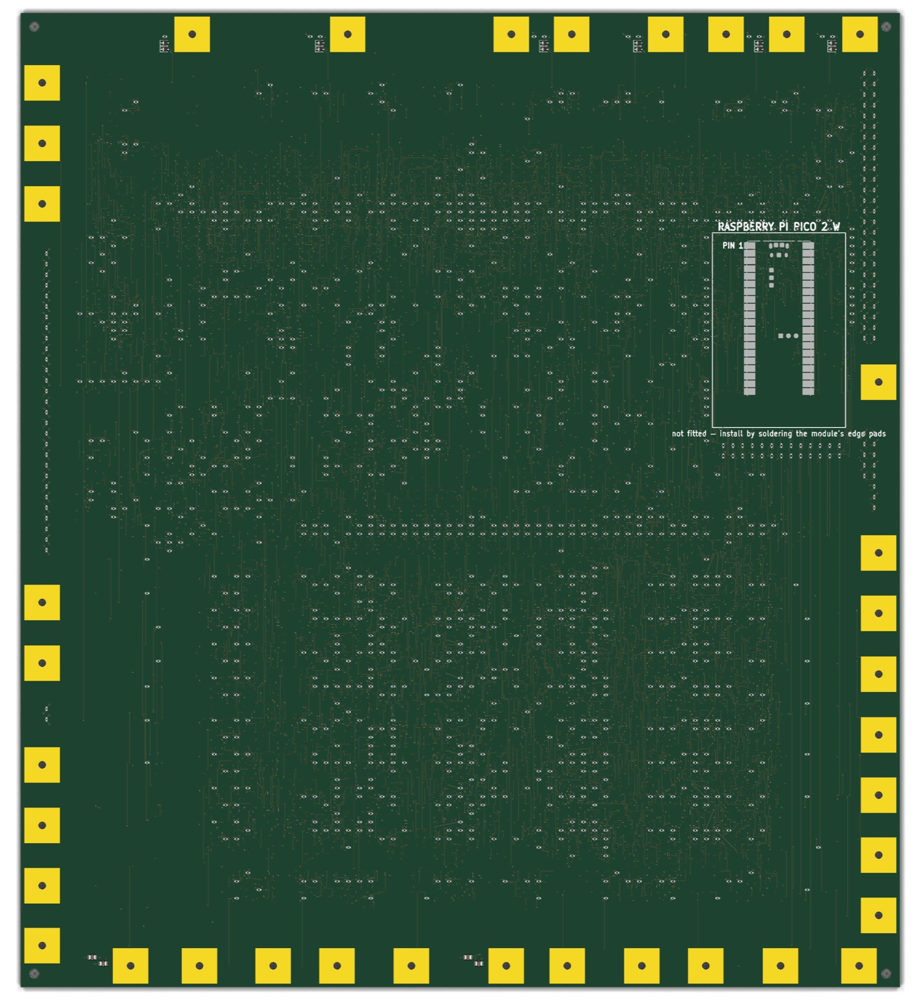

<a href="https://claude.ai"></a>

# discrete6502

A complete, verified design for a **MOS 6502 CPU built from 4,051 discrete surface-mount
transistors** (3,996 logic + 55 LED drivers), laid out as a 291 × 322 mm six-layer PCB that
visually reproduces the original 6502 die — every FET sits at its transistor's die-true
position, 55 LEDs blink the register bits in place, and a ring of die-scaled bond pads around
the edge takes crocodile clips.

The design is finished and every check passes, but **no board has been built yet** — nothing
here has been proven in copper, only in simulation and geometry. See
[Status](#status) for what that means.

**→ [Illustrated project introduction](https://epatel.github.io/discrete6502/)** — start here if
you want the story rather than the build.

Inspired by the [MOnSter 6502](https://monster6502.com/) (concept only — independently designed
and simplified). Logic ground truth is the [visual6502](http://visual6502.org) reverse-engineered
netlist, captured from photographs of a real decapped 6502.

<!-- The lighter docs/img JPEGs rather than the 5.5 MB gen/*.png pair: same
     renders, indistinguishable at this size, a quarter of the bytes.
     Explicit widths because a markdown table sizes its columns to the header
     text, so "Back (passives + Pico site)" would otherwise render ~7% larger
     than "Front (the die)" even though both images are exactly 1474x1600. -->

| Front (the die) | Back (passives + Pico site) |
|---|---|
|  |  |

## Status

**Rev A ordered 2026-07-28 and in production** — 5 boards, 4 of them assembled.
Both manufacturer confirmation gates passed (PCB stackup verified by measurement,
SMT placement verified on the DFM image).
Release record with file fingerprints and full verification results:
[`gen/fab/RELEASE.md`](gen/fab/RELEASE.md); step-by-step ordering checklist:
`gen/fab/ordering.html`. Bring-up (M6) starts when boards arrive.

Verified against the exact board in that package: switch-level equivalence **PASS**,
board-vs-netlist parity **0 errors**, independent copper connectivity **0 broken**,
DRC **0 electrical violations** (2 benign items inside the Pico library footprint)
and **0 unconnected**.

| Milestone | State |
|---|---|
| M1 Research (visual6502 data, MOnSter lessons) | ✅ |
| M2 Feasibility (dynamic NMOS, pass-FET pairs, SPICE) | ✅ |
| M3 Toolchain (KiCad, scripted netlist pipeline) | ✅ |
| M4 Verification (switch-level equivalence, vendor-model SPICE) | ✅ |
| M5 Layout (placement, routing, DRC-clean, fab outputs) | ✅ |
| M6 Fab & bring-up | ⏳ |

### Rev A vs rev B

**Rev A is what is being built.** After the order was placed, a defect was found that the
verification chain was structurally unable to see: the transform preserved the netlist's
*topology* but not its device *ratios*. Ratioed NMOS needs a weak load against a strong
pull-down; the 1,018 depletion loads correctly became 10 kΩ resistors, but the enhancement-mode
VCC-side FETs kept the same BSS138W as their pull-down — a 1:1 ratio. On the eight data-bus
output drivers that costs **262 mA and 0.90 W per FET** (against 220 mA and ~0.3 W ratings) and
leaves the logic low at **1.0–1.9 V against a 1.1–1.5 V threshold**, so the stage can read high
when it should read low. Measured in [`sim/driver_contention.sp`](sim/driver_contention.sp);
the corroboration is that it puts the board at ~2 A / ~10 W, which is exactly where the MOnSter
6502 has always been published.

**Rev A boards are fixable by hand:** 10 kΩ in series with eight FETs, all on the front face in
one column. **→ [Illustrated rework instructions](https://epatel.github.io/discrete6502/rework-dor-series-r.html)**
— true-scale renders of all eight sites generated from the board file, the exact coordinates, the
procedure and its verification steps. (Source: [`docs/rework-dor-series-r.html`](docs/rework-dor-series-r.html).)

**Rev B fixes it in the generator.** `DISCRETE6502_REV_B=1 python3 tools/gen_netlist.py` emits a
series resistor for every one of the 164 VCC-side FETs, sized per net from its gate load (10k
where the net drives one gate, down to 100R on the 13 nF clock nets, all values already in the
BOM). The equivalence gate is green on rev B. **No rev B board has been made** — it needs the
full pipeline re-run from placement onward, so it is a respin rather than a patch. Rev A output
is byte-identical with the flag off, so the fabricated design cannot drift.

## Highlights

- **Faithful dynamic NMOS logic** — not a static re-design: the visual6502 netlist's 3,239 unique
  transistors, with the 778 bidirectional pass transistors implemented as back-to-back FET pairs
  (BSS138W; clock-edge bootstrap validated in SPICE with the manufacturer's model) and 1,023
  pull-up resistors standing in for the depletion loads. Realistic clock ~10–20 kHz — the decode-PLA
  input lines drive up to 71 discrete gates behind one 10k pull-up (`sim/fanout_speed.sp`).
- **Machine-checked correctness**: a switch-level simulator proves the transformed netlist
  produces bit-identical traces to the original visual6502 netlist while running real 6502
  code; board-vs-netlist parity and independent copper-connectivity checks close the chain.
  Final DRC: zero electrical violations.
- **Reverse validation** (`tools/extract_netlist.py`): the netlist is also read back *out of
  the copper* — every net label discarded, conductors recovered geometrically from pads,
  tracks, vias and zone fills — giving 0 opens and 0 shorts against the intended netlist, and
  a netlist that runs the 6502 test program correctly. The copper, read as copper, executes
  instructions. Verified to be able to fail: cutting one track reports exactly one open.
- **Custom autorouter** (`tools/route_nc.c/.py`): a PathFinder-style negotiated-congestion router
  — nets route through conflicts, shared cells get iteratively penalized, conflicted nets
  rip-up and retry — on a 0.13 mm grid over 4 routing layers, with warm-start checkpoints.
  8,421 signal connections routed; the C core does a full negotiation iteration in seconds.
- **Bring-up harness built in**: an unpopulated Raspberry Pi Pico 2 W site on the back is wired
  to serve as clock master and memory emulator (data bus, 14 address bits with 16 KB mirroring,
  reset, R/W, SYNC via factory-fitted series resistors), so the intended workflow is to solder a
  Pico on, flash the firmware, and run programs with full bus tracing — no other computer needed.
  The firmware in `pico-controller/` is written and builds, but is **untested against hardware
  that does not exist yet**.

## Power budget

Dominated by the NMOS pull-up current, not switching. Component counts are from
`gen/netlist.json`; the LED figure is simulated (`sim/led_tap.sp`).

| Contribution | Basis | Typical | Worst case |
|---|---|---|---|
| Pull-up static current | 1,023 × 10 kΩ, 0.50 mA per node held low; ~half low at any moment (worst case: all) | 0.26 A / 1.28 W | 0.51 A / 2.56 W |
| Register LEDs | 55 taps × 1.42 mA; ~half the monitored bits set (worst case: all lit) | 0.04 A / 0.20 W | 0.08 A / 0.39 W |
| Dynamic switching | 109 nF total gate capacitance; 21 nF of it on clock-rate nets, rest at ~15% activity, at 10 kHz | ~9 mW | ~45 mW at 50 kHz |
| Pico 2 W, if VSYS is soldered | ~30 mA at 3.3 V through its buck | 0.02 A / 0.12 W | 0.03 A / 0.15 W |
| **Total @ 5 V** — ⚠️ *incomplete, see below* | | **≈ 0.32 A / 1.6 W** | **≈ 0.63 A / 3.2 W** |
| **Total @ 5 V, as actually built** | driver contention added | **≈ 2.1 A / ≈ 10.4 W** | |

> **SUPERSEDED 2026-08-01 — this table is wrong by about 6x.** It counts pull-up
> resistors, LEDs and switching only. It does not count **driver contention**: the
> eight data-bus output drivers hold a VCC-side FET and a pull-down FET on
> together for 47–93% of the time, drawing 262 mA each at 5 V. Measured in
> `sim/driver_contention.sp`, that adds **+1.76 A and +8.8 W**, taking the board to
> **≈2.1 A / ≈10.4 W** — which is where the MOnSter 6502's published 2 A / 10 W was
> all along. **A 1 A supply is not enough; use 3 A.** Full analysis and the rework
> that fixes it: "Driver contention" in `project-plan.md`.

~~**A 5 V / 1 A bench supply covers even the worst case.**~~ **Use 3 A** — see the
correction above. The old comparison line read "compare the original MOnSter 6502
at ~10 W", which in hindsight was the clue: same logic, same style, and it should
never have been six times cheaper. With contention counted, this board lands in
the same place. The 8.8 W of contention is *not* spread over the 900 cm² board
either — it is concentrated in eight SOT-323s in one column, which is the whole
problem.

At 3.3 V (the diagnostic fallback rail — bring-up starts at 5 V, see
`pico-controller/README.md`):
**≈ 0.19 A / 0.64 W typical, 0.38 A / 1.3 W worst case**. The LEDs there draw
0.67 mA each instead of 1.42 mA, because the 2.2 kΩ ballast has 1.4 V less
headroom above the LED's ~1.85 V forward drop — 47% of the current, but only
about 20% less *perceived* brightness (perception goes roughly as the cube root
of luminous output): dimmer, still perfectly readable.

Transient behaviour is more interesting than the average: the `cclk` net alone
carries 13 nF of gate load (482 gates), so clock edges pull ~50–100 mA for a
microsecond or two. That is what the 96 distributed 100 nF decouplers and 4 ×
10 µF bulk caps are for — they hold the rail to ~10 mV of droop across an edge.

## Repository layout

- `project-plan.md` — goals, milestones, decision log, current handoff (start here)
- `cards/` — deep-dive notes per topic (architecture, layout, verification, …)
- `data/visual6502/` — the reverse-engineered netlist source data
- `tools/` — the entire generation pipeline: netlist transform, die placement, power routing,
  the negotiated-congestion signal router, finishing passes, silkscreen, verification
- `sim/` — ngspice testbenches: pass-pair latch, 3.3 V validation, LED brightness, fanout speed
- `gen/` — generated artifacts: netlist, boards (`board_routed_golden.kicad_pcb`), renders,
  and the JLCPCB fabrication package (`gen/fab/`)

## Regenerating the board

The full pipeline, in order (KiCad 10's bundled python for board steps):

```
python3 tools/gen_netlist.py         # visual6502 data -> netlist (+ invariant checks)
python3 tools/switchsim.py           # equivalence gate: must stay green
<kicad-python> tools/gen_pcb.py      # die-true placement, board setup
<kicad-python> tools/route_power.py  # planes + ~3,700 stitch vias
<kicad-python> tools/route_power_finish.py   # (on the presignal snapshot)
<kicad-python> tools/route_nc.py     # signal routing (hours; checkpointed)
<kicad-python> tools/fix_same_net_vias.py
<kicad-python> tools/fix_via_pairs.py
<kicad-python> tools/enlarge_vias.py  # 0.30mm drills for JLC's free class
<kicad-python> tools/add_silk.py
<kicad-python> tools/check_parity.py && tools/check_gaps.py + kicad-cli drc
<kicad-python> tools/extract_netlist.py   # rebuild the netlist from copper (LVS)
python3 tools/switchsim.py           # now also simulates the extracted netlist
```

See `cards/layout.md` for the rules and hard-won caveats behind each step.

## License & attribution

Copyright © 2026 Edward Patel.

This project is licensed **[CC BY-NC-SA 4.0](LICENSE)** (Creative Commons
Attribution-NonCommercial-ShareAlike 4.0 International) — the full legal code is in
[`LICENSE`](LICENSE). It covers **everything in the repository**: the board design and
generated artifacts in `gen/`, the generation and verification tools in `tools/`, the SPICE
testbenches in `sim/`, the Pico firmware in `pico-controller/`, and the documentation.

In short: use it, modify it and share it, with **attribution**, for
**non-commercial** purposes, and share derivatives under the **same terms**.

The licence is inherited rather than chosen. The design's ground truth is the visual6502
project's netlist data, whose `segdefs.js` is itself CC BY-NC-SA, so this work carries the
same terms forward. Attribution is owed to [visual6502.org](http://visual6502.org), which
traced a real 6502 die photograph by photograph and made the result public.

The MOnSter 6502 by Eric Schlaepfer and Evil Mad Scientist Laboratories proved a discrete
6502 is possible and is gratefully acknowledged as inspiration. This is an independent
design and is not affiliated with that project.
