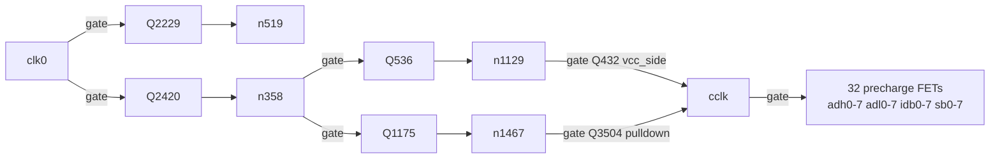

# Proposal: a pull-down resistor from CLK0 to VSS

**Status: proposed, not fitted. Written 2026-08-30 for review by another agent.**
Origin: [user suggestion, endorsed] recorded in `project-plan.md`'s 2026-08-29 (later) handoff entry.

**The claim being reviewed:** fitting a 10 kΩ (better 47 kΩ) resistor from the `CLK0` bond pad to
`VSS` would hold the board in its ~0.30 A quiet state whenever nothing is driving the clock —
BOOTSEL, reset, power-up before firmware starts, and between firmware loads — which is when every
failure of the evening of 2026-08-29 happened. **A pull-UP would be the worst possible choice**, for
the reason developed below.

This file is self-contained. Every claim states how to check it; nothing needs to be taken from the
plan on trust.

---

## 1. The mechanism, traced rather than asserted

`clk0` reaches the internal clock phase `cclk` through **two inversions**, so the chain is
non-inverting: **the level on `clk0` is the level on `cclk`.**



Walk it in both directions (`R219`, `R675` are 10 kΩ pull-ups):

| `clk0` | `n358` | `n1129` | `n1467` | `cclk` | the 32 precharge FETs |
|---|---|---|---|---|---|
| **HIGH** | Q2420 on ⇒ **LOW** | Q536 off, R675 ⇒ **HIGH** | Q2300 on ⇒ **LOW** | Q432 on, Q3504 off ⇒ **HIGH** | **all ON** |
| **LOW** | Q2420 off, R219 ⇒ **HIGH** | Q536 on ⇒ **LOW** | Q1175 on ⇒ **HIGH** | Q432 off, Q3504 on ⇒ **LOW** | **all OFF** |

Reproduce the whole table from the netlist alone:

```bash
python3 - <<'PY'
import json; C = json.load(open("gen/netlist.json"))["components"]
on = lambda n: [c for c in C if n in c["pins"].values()]
for n in ("clk0","n519","n358","n1129","n1467","cclk"):
    print(n, [(c["ref"], c.get("role"), c["pins"]) for c in on(n)])
pre = [c for c in C if c.get("role")=="vcc_side" and c["pins"].get("1")=="cclk"]
print(len(pre), "cclk-gated precharge FETs")
PY
```

It prints **32**, on `adh0-7`, `adl0-7`, `idb0-7`, `sb0-7`. Sixteen of them (`adh`, `adl`) have the
10 kΩ series rework; **`idb0-7` and `sb0-7` do not**, which is the standing hardware fault.

## 2. Why the polarity matters so much

`clk0` has **no pull-up and no pull-down anywhere on the board.** Its only connections are:

| Part | Role | Note |
|---|---|---|
| `Q2229`, `Q2420` | pull-down FET gates | 2 gates ≈ 54 pF of Ciss, the whole DC load |
| `R1079` 100 R | input protect | `clk0_ext` → `clk0` |
| `D66` / `D67` | clamp to VCC / VSS | 1N4148WS, leakage only |
| `R1107` 1 k | Pico series | `clk0_ext` → `pico_p29` (GP29) |

So the pin floats whenever GP29 is an input — **which includes BOOTSEL, reset, and the whole
interval between power-up and firmware `bus_init()`**. A floating gate drifts, and if it drifts
above the ~1.5 V threshold the table above puts all 32 precharge FETs on at once.

**That is the entire supply problem.** At `sim/driver_contention.sp`'s 262 mA per contended pair,
eight simultaneously is ~2.1 A — the order that folded a 2.4 A charger to 3.6 V at 2.5 A and tripped
a 3 A adapter outright. It also reconciles two figures the plan carried as contradictory for weeks:

- *"clock parked, 0.30 A"* — measured with the Pico fitted, where `bus_init` **drives clk0 low**
- *"clock parked, 2.2 A"* — measured with clk0 **floating**

Same words, opposite pin states, 7× apart.

**Therefore: pull DOWN, never UP.** A pull-up parks `cclk` HIGH and turns all 32 precharge FETs on
permanently — it would guarantee the failure state rather than prevent it.

## 3. Sizing

Node capacitance is ~54 pF of gate plus the `TP25` bond pad (11.6 mm, over planes) and its track —
call it 100–200 pF. Drive is Pico GP29 at 3.3 V through 1.1 kΩ total (`R1107` + `R1079`).

| R | V(clk0) when driven high | Current while high | Decay when released (200 pF) |
|---|---|---|---|
| 10 kΩ | 3.3 × 10/11.1 = **2.97 V** | 297 µA | 2 µs |
| 47 kΩ | 3.3 × 47/48.1 = **3.22 V** | 69 µA | 9.4 µs |

Both leave the high level far above the 0.8–1.5 V threshold, and both are orders of magnitude faster
than the 400 µs low phase. **47 kΩ is the better choice** — it gives up almost nothing on the high
level and still slews in microseconds. 10 kΩ is acceptable and is what is already in the BOM.

Neither loads the Pico meaningfully (GP29 is rated 12 mA).

## 4. Where to fit it — and this is the part most worth reviewing

**Option A — `TP25` → `TP35`, i.e. the bond pads.** Croc clips onto two 11.6 mm pads, no soldering,
instantly reversible. **But they are on opposite edges of the board**: `TP25` (Φ0) is at
x 234.06, y 7.05 and `TP35` (VSS) at x 130.20, y 314.95 — **about 308 mm apart on a 322 mm board.**
There is exactly one VSS pad in the whole 36-pad ring, so this cannot be shortened.

**Option B — on the Pico side of the series resistors**, i.e. from `R1107`'s `pico_p29` pad to any
nearby VSS (a back-side decoupling pad). This is **electrically strictly better**: the pull-down sits
on the *driver* side of the 1.1 kΩ, so when GP29 drives high there is no DC path through the series
resistors and `clk0` sees the full 3.3 V with **no divider loss at all**, while a floating GP29 is
still pulled to VSS and takes `clk0` with it. Cost is 0402-scale soldering beside the Pico instead of
two croc clips.

**Recommendation: Option A with 47 kΩ for the bench, now.** The wire carries ~70 µA at ~2.3 kHz, so
its length is not a signal-integrity problem, and the value of the change is that it works when
nothing else is powered — which argues for the version that needs no soldering. Option B is the
right answer if this becomes permanent.

## 5. What this does *not* fix

- **It is not a fix for the 16 un-reworked precharge sites** (`idb0-7`, `sb0-7`). Those still contend
  whenever the clock is genuinely high, which is most of what a running board does. The pull-down
  only removes the *undriven* failure mode.
- **It does not preserve CPU state.** Parked low, the dynamic nodes decay in ~1.13 ms (measured,
  board #1, 2026-08-24). That is fine — nothing is running when nothing drives the clock.
- **The 2.1 A figure is directional, not exact.** It assumes eight pairs each at the simulated
  262 mA. Whether all eight (or sixteen) contend simultaneously at DC depends on the state of their
  pull-downs, which is undefined on an unclocked board. The *direction* is certain; the magnitude is
  an estimate.

## 6. Questions for the reviewer

1. Is the two-inversion trace in §1 right? It is the load-bearing claim, and it is derived from
   `gen/netlist.json` only — no simulation was run to confirm the DC levels.
2. Is there a reason to prefer 10 kΩ over 47 kΩ that the table in §3 misses — noise pickup on a
   308 mm wire, say, at a node whose only load is two FET gates?
3. Option A vs Option B: is the divider loss (3.3 → 2.97 V at 10 kΩ) worth any concern at all given
   Vgs(th) is 0.8–1.5 V, or is the convenience argument decisive?
4. Anything in `D66`/`D67` (the clamp pair) that a permanent DC path to VSS interacts with badly?

## Sources

- `gen/netlist.json` — every part and net named above; the snippet in §1 regenerates the trace.
- `navigator/data/board.json` — the pad positions in mm (or query the navigator: `navctl.py part TP25`).
- `project-plan.md`, handoff 2026-08-29 (later) — where the finding and the suggestion are recorded.
- `cards/driver-contention.md` — the 262 mA figure, its provenance, and both of its retractions.
- `sim/driver_contention.sp`, `sim/fanout_speed.sp` — the contention current and the ~25 µs settling bound.
